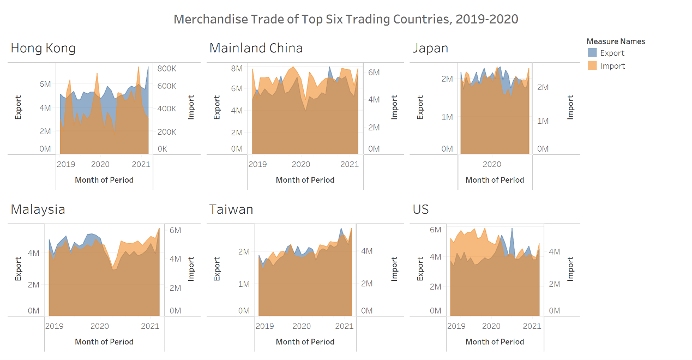
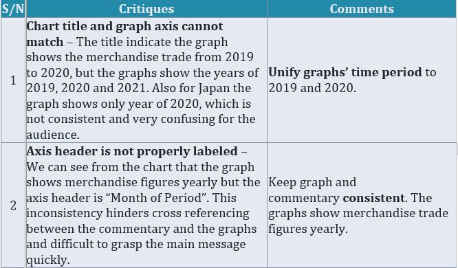
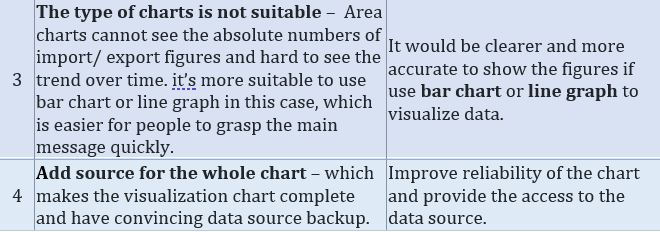
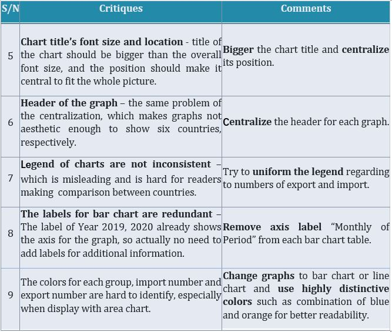
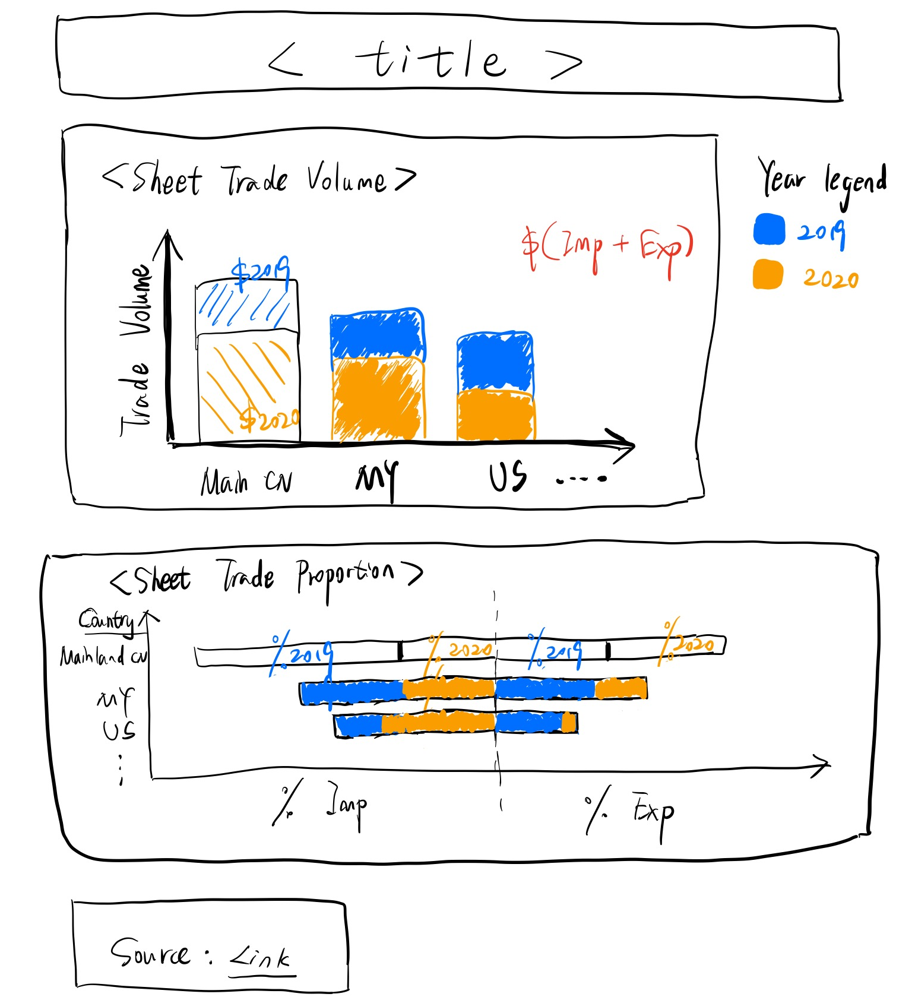
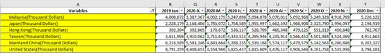
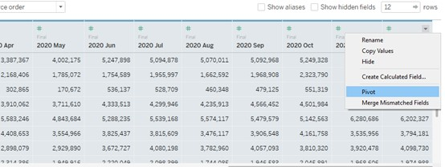
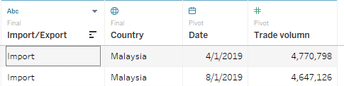
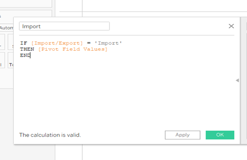
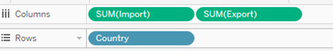

```{r setup, include=FALSE}
knitr::opts_chunk$set(echo = FALSE)
```

    
# 1)	The original visualisation

*Figure 1: Chart of Merchandise Trade by Region/Market, 2019 – 2020*


*Notes:*

* Dataset refers to Merchandise Imports & Exports By Region/Market
* _Source: [ENTERPRISE SINGAPORE](https://www.singstat.gov.sg/find-data/search-by-theme/trade-and-investment/merchandise-trade)_, Data last updated: 17/05/2021

Before making over the selected visualisation, it is important to have a clear understanding of the context of the visualisation and its key takeaways which are dependent on:
 
* Who: Top six trading countries all around the world. 
* What: Drawing the visualization graph and getting a better understanding of merchandise trade of these six countries over the past 2 years (2019 to 2020).
* How: Showing the import and export numbers as well as distribution and making comparison analysis of six countries.


# 2)	Critiques and suggestions for current visualisation
## 2.1 Clarity



## 2.2 Aesthetics



# 3)	 Proposed Design

## 3.1 Sketch

*Figure 2: Sketch of proposed design*

## 3.2 Desigh ideas

First of all, bar chart shows the absolute numbers of trading volumes in 2019 and 2020 for the six countries which provide the whole picture of the trading performance; then use pyramid chart to give the detailed export and import performance of six countries over two years. 

# 4) Data visualisation steps
## 4.1 Data preparation
**1. Remove unnecessary rows and columns for sheet T1**

Delete  rows 1-5 and 127-140 and filter targeted rows, which are six targeted countries; Keep columns which are targeted time period, 2019 and 2020.


*Figure 3: Remove unnecessary rows and columns*

**2. Do the same steps for sheet T2**
**3. Combine sheets T1 and T2** 

Combine two sheets together, add one more column “Import/Export” to differentiate and rename the country names for concise purpose.

*Figure 4: Combine two sheets*

**4. Pivot data**

Import file into Tableau, select all the years, right click and select “Pivot”.

*Figure 5: Pivot*

**5. Rename headers and change data type for columns**

Rename ‘Variables’ to ‘Country’ and change data type to geographic role - country. Rename ‘Pivot Field Names’ to ‘Date’ and change data type to date. Rename ‘Pivot Field Values’ to ‘Trade Value’.


*Figure 6: Modify headers and data type*

## 4.2 Data visualisation
**1. Create line chart**

1.1 Drag **Country** and **Trade Volume** to Columns and Rows respectively.
.png){width=70%}

*Figure 7: Create line chart*

1.2 Sort by Trade Volume and Update view from ‘Standard’ to ‘Entire View’.

1.3 Add reference line for Trade Volume

Apply average trade volume for six countries and custom label for the reference line, formatting the line at the same time.

.png){width=60%}
*Figure 8: Add reference line*

1.4 Format reference line

Change the font color to red and use currency format for numbers.
.png){width=50%}
*Figure 9: Format for reference line*

1.5 Drag **Trade Volume** to Label, and format labels with bigger size and bold font, also in custom currency format without decimals.
.png){width=50%}
*Figure 10: Add label*

1.6 Hide field labels ‘Country’ for columns

1.7 Drag <Date> to color and choose color blue for year 2019 and color orange for year 2020

1.8 Rename the chart title as ‘Trade Volumn of Top 6 Countries by Year 2019 & 2020’

**2. Create line chart**

2.1 Analysis - Create calculated field for ‘Import’
{width=50%}
*Figure 11: Create calculated field*

2.2 Same step for creating field ‘Export’

2.3 Drag **Country** and **Import**, **Export** to Rows and Columns, respectively.

{width=50%}
*Figure 12: Choose variables*

2.4 Edit Axis for <Import>, reversed the scale

{width=50%}
*Figure 13: Edit axis*


2.5 Sort for Import in descending order

2.6 Convert to percentage : 
* Right click [SUM(Import)] > Quick Table Calculation > Percent of Total.
* Right click [SUM(Export)] > Quick Table Calculation > Percent of Total.

2.7 Drag **Date** to color for SUM(Import) and SUM(Export) respectively, and choose color blue for year 2019 and color orange for year 2020

2.8	Drag **Import** to label, bigger the font size, change to white color and bold as well; format the numbers to percentage without decimals.


{width=70%}

*Figure 14: Change label format*

2.9 Update view from ‘Standard’ to ‘Fit Width’.

2.10 Rename the chart title as  ‘Proportion of Trade Volume by Year 2019 & 2020’

**3. Create dashboard**

3.1 Add sheets
Add sheet “Trade Volume” on the top and sheet “Trade Proportion” to the bottom. Retain one year band legend, place it at the right corner.

3.2 Add title
Click the checkbox “Show dashboard title” and add title : “The Trade Volume and Proportion of Import/Export by Year 2019 and 2020” with font size 20 and put in center.

3.3 Add source
Using Objects > Text > drag to bottom left and add :
“Source: Department of Statistics, Singapore (https://www.singstat.gov.sg/))


# 5) Final visualisation
## 5.1 Snapshot of dashboard

*Figure 15: Dashboard Full visualisation available at [Tableau Public](https://public.tableau.com/app/profile/lemon5793/viz/Top6tradingcountries/Dashboard1)*

## 5.2 Main observations
1. In year 2019 and 2020. Mainland China has the highest trade volume among the top six trading countries, followed by Malaysia. The figure of the US also beyond average benchmark. Other countries, i.e. Taiwan, Hong Kong and Japan are below benchmark regarding to the total trading volume over two years.
2. Looking into year 2019 and 2020 separately, Mainland China still remain the top  1 place for total trading volume. The rank remain stable for other countries as well.
3. The rank of import volume for six countries is similar to the rank of total trading volume, except for Japan, which figure exceeded Hong Kong. 
4. There are some changes of rank for six countries with regard to export volume, Mainland China still remain the top 1, which followed by Hong Kong, Malaysia, United States, Japan and Taiwan.
5. Mainland China had the undisputed strength towards overall trading performance, while Hong Kong had the smallest figure for import volume but surprisingly performed good at export performance.
6. The proportion of export and import is similar for all 6 countries from 2019 to 2020. Mainland China, Japan and Hong Kong remain exactly the same. The percentage of export for Malaysia increased 2%; the US’s import dropped 3% and export dropped 2%; the import proportion of Taiwan increased 1%.