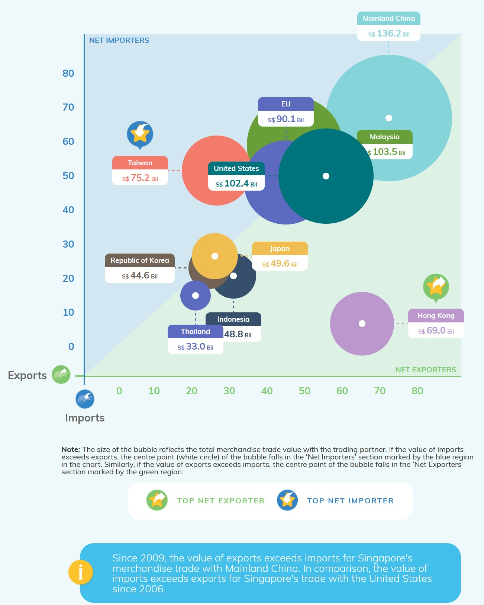

```{r setup, include=FALSE}
knitr::opts_chunk$set(echo = FALSE)
```

    
# 1)	The original visualisation

*Figure 1: Chart of Merchandise Trade Performance With Major Trading Partners, 2020*

# 2)	Critiques and suggestions for current visualisation
## 2.1 Clarity


## 2.2 Aesthetics


# 3)	 Proposed Design

## 3.1 Sketch

*Figure 2: Sketch of proposed design*

## 3.2 Advantages of proposed design

i)	Clear title – Chart titles tell the big picture story, and make it interactive to show the change over years.
ii)	Add reference line for Top 20% countries, which 80% for both percentile of Imports and Exports
iii)	Make interactive Date selecting pane for each country to show year to year change clearly.


# 4) Data visualisation steps
## 4.1 Data preparation
**1. Remove unnecessary rows and columns for sheet T1**

Delete  rows 1-5 and 127-140 which are explanation information about data, also remove rows for total merchandise imports and 6 continents cause the comparison is between countries; Also only keep columns which are targeted time period, from January 2011 to December 2020.


*Figure 3: Remove unnecessary rows and columns*

**2. Do the same steps for sheet T2**

**3. Combine sheets T1 and T2** 

Combine two sheets together, add one more column “Import/Export” to differentiate and rename the country names for concise purpose.

*Figure 4: Combine two sheets*

**4. Add one more column named “Trade Volume by Country”**

Add up export and import value for each country.
{width=50%}
*Figure 5: Add one more column*

**5. Pivot data**
Import file into Tableau, select all the years, right click and select “Pivot”

*Figure 6: Pivot data column*

**6. Rename headers and change data type for columns**

Rename ‘Variables’ to ‘Country’ and change data type to geographic role - country. Rename ‘Pivot Field Names’ to ‘Date’ and change data type to date. 


*Figure 7: Modify headers and data type*

## 4.2 Data visualisation

**1. Create bubble chart**

1.1. Create calculated field for ‘Imports‘, same step for creating field ‘Exports’
{width=70%}

*Figure 8: Create calculated field*

1.2. Drag [Imports], [Exports] to Columns and Rows, respectively. and shows them by Country.

{width=70%}

*Figure 9: Create Scatter Plot*

1.3. Handle with NA values

{width=60%}

*Figure 10: Modify NA values*

1.4. Change both axis to percentile to make each data point clearer
Right click [SUM(Imports)] > Quick Table Calculation > Percentile.
Right click [SUM(Exports)] > Quick Table Calculation > Percentile.

{width=50%}

*Figure 11: Change both axises to percentile format*

1.5. For both imports and exports, compute using country

1.6. Differentiae size for each country according to their total trade volume. Marks by circle and change size, opacity and border color to make it easier to see.Hide field labels ‘Country’ for columns

{width=50%}

*Figure 12: Format circle size according to trade volume*

1.7. Color the bubble
Drag trade volume by country to color pane to make the bubbles which represent larger merchandise volume have darker color.

{width=50%}

*Figure 13: Color coding for bubble*

1.8. Add reference line and format for both axis, constant value for 80%

{width=50%}

*Figure 14: Add reference line*

{width=50%}

*Figure 15: Format reference line*

1.9. Edit title for the graph

{width=50%}

*Figure 16: Add graph title*

1.10. Add year to filter and customize the format

{width=50%}

*Figure 17: Add Year filter*

1.11. Make data labels clearly
The percentile value is not very intuitive, create two calculated fields: “Ranking by Exports” and “Ranking by Imports”

{width=50%}

*Figure 18: Created calculated field*


1.12. Remove the percentile in tooltip and add ranking information

{width=50%}

*Figure 19: Modify Tooltip*

**2. Create line chart**

2.1. Make line charts for Exports and Imports respectively
{width=50%}


*Figure 20: Create line chart*

2.2. Synchronize axis

2.2. Add chart title

{width=50%}

*Figure 21: Add chart title*

**3. Interactive Purpose**

3.1. Create one more filter for top countries
Create calculated volume named “Ranking by Trade Volume”

{width=50%}

*Figure 22: Create calculated field*

3.2. Insert the line chart into bubble chart 
Modify the content and format of bubble chart by tooltip.

{width=50%}

*Figure 23: Modify the tooltip of bubble chart*

# 5) Final visualisation
## 5.1 Snapshot of dashboard

*Figure 24: Dashboard Full visualisation available at [Tableau Public](https://public.tableau.com/app/profile/lemon5793/viz/MerchandiseTradePerformance/InteractiveBubblePlot)*

## 5.2 Main observations
1. In year 2020, China's total merchandise volume, i.e. Exports volume plus Imports volume ranked in the first place, however it does not mantain in the first place during the observing time period.
2. Regarding to total merchandise volume, the top 5 countries are Hong Kong, Mainland China, Indonesia, Malaysia, Taiwan and United States. However, Hong Kong’s Exports volume not always beyond Top20% compared with other countries, we can see Hong Kong is strong in Imports but weak in Exports performance. 
3. Five more countries include for the list of Top 10 countries. Japan, Thailand, India and Korea. Indian’s Imports performance is not always beyond the Top20% benchmark.
4. Choose filter pane for year, we can see each country’s Exports and Imports volume changing in an interactive way, which doesn’t change dramatically during the observing time period, 2011 to 2020.